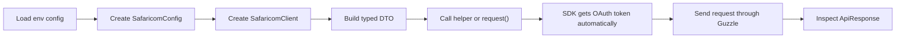

# PHP Safaricom Daraja SDK (M-Pesa API Integration)

[](https://packagist.org/packages/statum/safaricom-daraja-sdk)
[](https://packagist.org/packages/statum/safaricom-daraja-sdk)
[](https://packagist.org/packages/statum/safaricom-daraja-sdk)

A PHP 8.2+ Safaricom Daraja SDK for production payment integrations across web and mobile apps. It provides a framework-agnostic PHP core with typed DTOs, Guzzle 7 transport, and optional Laravel support for Daraja and M-Pesa workflows.

## Features & Supported Services

This SDK follows the current Safaricom developer portal and the verified endpoint contracts in this repository. It includes:

- A framework-agnostic `request()` method for Daraja endpoints
- Typed request DTOs for every covered endpoint
- OAuth access token acquisition and bearer token handling
- Helper methods for the supported Daraja and M-Pesa flows
- STK password generation from shortcode, passkey, and timestamp
- Security credential generation from Safaricom public certificates
- PHPUnit coverage with Guzzle `MockHandler`

## Installation

```bash
composer require statum/safaricom-daraja-sdk
```

## Dependencies

- PHP `^8.2`
- Guzzle `^7.13`
- PHPUnit `^11.5` for tests
- PHPStan `^1.12` for static analysis

## Getting Started

1. Install the package with Composer.
2. Put your consumer key, consumer secret, and environment in `.env` or your app config.
3. Create a `SafaricomConfig` in your application bootstrap, service container, or Laravel service provider.
4. Resolve a `SafaricomClient` from the container, or create it once and reuse it.
5. Call a typed helper or the generic `request()` method.

The SDK handles OAuth token acquisition automatically for helper calls.

Why this is structured this way:

- `SafaricomConfig` is the immutable application-level input for Safaricom credentials, environment, timeouts, and default headers.
- `SafaricomClient` is the reusable HTTP client facade that holds the config and manages bearer token acquisition for you.
- Keeping config and client separate makes it easier to swap sandbox versus production, inject the client in tests, and reuse the same client across requests.

Plain PHP bootstrap example:

```php
use Statum\Safaricom\Daraja\Client\SafaricomClient;
use Statum\Safaricom\Daraja\Config\SafaricomConfig;
use Statum\Safaricom\Daraja\Environment\Environment;

$environment = ($_ENV['SAFARICOM_ENVIRONMENT'] ?? 'sandbox') === 'production'
    ? Environment::Production
    : Environment::Sandbox;

$config = new SafaricomConfig(
    consumerKey: $_ENV['SAFARICOM_CONSUMER_KEY'] ?? '',
    consumerSecret: $_ENV['SAFARICOM_CONSUMER_SECRET'] ?? '',
    environment: $environment,
);

$client = SafaricomClient::create($config);
```

Flow overview:



## Documentation Map

If you read one document first, read [docs/endpoint-guide.md](docs/endpoint-guide.md). It is the primary developer reference for helper-to-endpoint mapping, required fields, and request examples.

Use the docs in this order:

- [docs/endpoint-guide.md](docs/endpoint-guide.md) for the primary helper, DTO, and endpoint contract walkthrough
- [docs/examples.md](docs/examples.md) for copy-paste-ready client, Laravel, and error-handling snippets
- [docs/api-reference.md](docs/api-reference.md) for the exact required fields, optional fields, and wire-level payload notes

The rule is simple:

- required API fields are required DTO constructor arguments
- optional API fields are nullable constructor arguments
- the DTO `toArray()` method shows the exact payload keys sent to Safaricom

If you are implementing a new flow, start with `docs/endpoint-guide.md`. If you are checking whether a field is required or optional, open `docs/api-reference.md`. If you need a working snippet, use `docs/examples.md`.

## Quick start

See [Examples](docs/examples.md) for copy-paste-ready usage patterns.

## Generating the STK Push password

Safaricom expects the password to be the Base64 encoding of the shortcode, passkey, and timestamp concatenated together.

See [Examples](docs/examples.md#stk-password) for the generator pattern. The passkey is not part of `SafaricomConfig`; it is a flow-specific secret used only to derive the STK password.

## Generating a security credential

Safaricom’s docs state that security credentials are generated by encrypting the initiator password with the M-Pesa public key certificate using RSA with PKCS#1.5 padding.

See [Examples](docs/examples.md#security-credential) for the generator pattern.

## Common Flows

Use the helper that matches the business flow. If a helper exists, prefer it over `request()` because the helper binds the DTO type and endpoint path together.

### STK Push

Use `stkPush()` with `StkPushRequest` when initiating an M-Pesa Express payment. The flow is: build the DTO, generate the STK password, call the helper, then wait for the callback or query the checkout request ID. See [Examples](docs/examples.md#basic-client-usage).

### STK Push Query

Use `stkPushQuery()` with the checkout request ID returned by the initial STK push to confirm the final payment state.

### C2B

Use `c2bRegisterUrl()` once to register the confirmation and validation URLs, then use `c2bSimulate()` in sandbox to test the callback flow. In production, Safaricom posts back to your registered endpoints.

### B2B and B2C

Use `b2bPaymentRequest()` for business-to-business payouts and `b2cPaymentRequest()` for business-to-customer payouts. These are request-and-response flows, so you should persist the response payload before you move on to downstream reconciliation.

### Transaction Queries

Use `reversalRequest()`, `accountBalanceQuery()`, and `transactionStatusQuery()` for the operational flows Safaricom exposes as account and transaction controls. These helpers are usually called after an operational event, not as the first step of a payment flow.

### Generic Request

If you need to call a supported path directly, use `request()` with the raw endpoint and a DTO. See [Examples](docs/examples.md#generic-request).

## Response Handling

`SafaricomClient` returns an `ApiResponse` wrapper.

- Use `json()` when you expect valid JSON and want a strict array.
- Use `decoded()` when you want a nullable array and do not want to throw on invalid JSON.
- Use `statusCode()` to inspect the HTTP status.
- Use `headers()` to inspect response headers.
- Use `body()` when you need the raw response body for debugging.
- Use `response()` if you need the underlying PSR-7 response object.

See [Examples](docs/examples.md#response-inspection) for a response inspection pattern.

If the body is not valid JSON, `json()` throws an `ApiException`.

## Supported endpoint helpers

The SDK includes helpers for the collection items and corresponding Daraja endpoints:

- OAuth token generation
- M-Pesa Express / STK push and query
- C2B simulate and register URL
- B2B payment request
- B2C payment request
- B2Pochi payment request
- Reversal
- Account balance query
- Transaction status query
- Pull transaction registration and query
- IMSI / SWAP / Age on Network checks
- B2B Hakikisha
- Mobile number validation
- Standing order creation
- SIM portal operations from the collection

Use `request()` if you want to call an endpoint that is not wrapped explicitly.

## Laravel support

The SDK is framework-agnostic, but it also ships an optional Laravel service provider and publishable config file.

- Auto-discovery provider: `Statum\Safaricom\Daraja\Laravel\SafaricomServiceProvider`
- Publish tag: `safaricom-daraja-config`
- Config file: `config/safaricom-daraja.php`
- The published config reads `SAFARICOM_*` environment variables by default.

### Installation

In a Laravel application:

```bash
composer require statum/safaricom-daraja-sdk
php artisan vendor:publish --tag=safaricom-daraja-config
```

The package auto-discovers the service provider, so no manual provider registration is required.

### Configuration

Update your `.env` file with the required values:

```env
SAFARICOM_CONSUMER_KEY=your-consumer-key
SAFARICOM_CONSUMER_SECRET=your-consumer-secret
SAFARICOM_ENVIRONMENT=sandbox
SAFARICOM_TIMEOUT=30
SAFARICOM_CONNECT_TIMEOUT=10
```

Set `SAFARICOM_ENVIRONMENT` to `sandbox` or `production`.

The published config uses these keys:

- `consumer_key`
- `consumer_secret`
- `environment`
- `timeout`
- `connect_timeout`
- `default_headers`

`default_headers` is an array and is merged into the outgoing request headers.

### Usage

Resolve the client from Laravel’s container and use the typed helper methods. See [Examples](docs/examples.md#laravel-controller) and [Examples](docs/examples.md#laravel-constructor-injection) for usage patterns.

If you are not using Laravel, you can ignore the provider entirely.

## Error Handling

The SDK throws three package-specific exceptions you should catch in application code:

- `ConfigurationException` for invalid local configuration or invalid DTO values
- `TransportException` for network, DNS, TLS, or Guzzle transport failures
- `ApiException` for Safaricom HTTP errors or invalid API responses

See [Examples](docs/examples.md#error-handling) for a catch-and-inspect pattern.

Notes:

- `SafaricomConfig` throws if the consumer key or consumer secret is empty, or if timeouts are negative.
- Most helper methods include bearer authentication automatically.
- `accessToken()` uses HTTP Basic auth internally.
- For invalid JSON responses, check `decoded()` before calling `json()` if you need to avoid an exception.

## Running tests

```bash
composer install
composer test
composer analyse
```

Recommended release checks:

```bash
composer validate --strict --no-check-publish
composer audit
git diff --check
```

## Research sources

- Safaricom Daraja portal: https://developer.safaricom.co.ke/apis
- PHP-FIG PSR-4: https://www.php-fig.org/psr/psr-4/
- PHP-FIG PSR-12: https://www.php-fig.org/psr/psr-12/
- Guzzle testing docs: https://docs.guzzlephp.org/en/stable/testing.html
- PHPUnit 11 supported versions: https://phpunit.de/supported-versions.html
